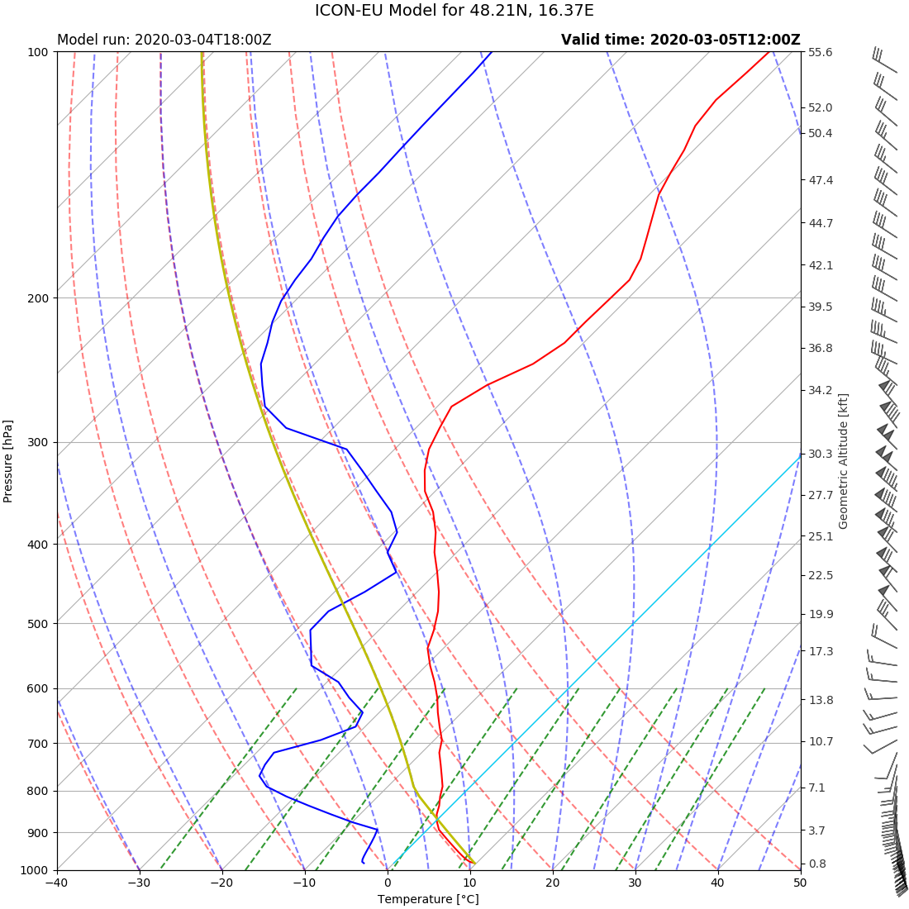

# ICON skew-T log-P Plot
API for plotting skew-T log-P thermodynamic diagrams with data from the DWDs 
ICON-EU weather forecast model. 

An example of the output produced:



## API Usage
Using the API is very easy and straightforward. An HTTP GET will start plotting the diagram, resulting in a simple
JSON with the model time, valid time and links to a full and lower level (detail) skew-T diagram. 

```
https://icon-skewt-plot.vektorraum.com/<latitude_north>/<longitude_east>/<valid_at_YearMonthDayHour>
```

The following parameters need to be provided:

| Parameter        | Format           | Example  |
| ------------- |:-------------| -----|
| latitude_north      | decimal latitude, north positive | 48.12 |
| longitude_east     | decimal longitude, east positive (as in ICON)      |   16.37 |
| valid_at | YearMonthDayHour with no separators and leading zeros      |    2020030512 |

Example Output of the API:

```json
{
  "model_time": "2020-03-04T18:00:00.000000000",
  "valid_time": "2020-03-05T12:00:00.000000000",
  "plot_full": "https://storage.googleapis.com/icon-skewt-plot/plot_48.21N_16.37E_2020-03-04T18_00_2020-03-05T12_00_full.png",
  "plot_detail": "https://storage.googleapis.com/icon-skewt-plot/plot_48.21N_16.37E_2020-03-04T18_00_2020-03-05T12_00_detail.png"
}
```

All times are in UTC.

Plotting currently takes about 30-50 seconds. Therefore timeouts need to be set high enough!

## DWD ICON-EU
While some tools and websites are available for thermodynamic diagrams based upon 
the GFS model this software provides the tooling for plotting skew-T log-P diagrams 
based upon the much higher resolution 
[ICON model](https://www.dwd.de/EN/ourservices/nwp_forecast_data/nwp_forecast_data.html).

This model currently provides a resolution of about 7km and 60 levels within Europe. The forecasts are available
for up to 120 hours, while forecasts up to 78 hours are available in hourly intervals. 

## DWD Open Data
DWD provides the ICON EU model output as open data on the 
[DWD open data server](https://www.dwd.de/DE/leistungen/opendata/opendata.html).

## NWP Sounding Backend
A second backend,
[nwp-sounding](https://github.com/fvalka/nwp-sounding), 
which is scaled up dynamically to over 100 instances, is used for speeding up the
plotting process. This backend uses the 
[ECMWFs ecCodes](https://confluence.ecmwf.int/display/ECC) library via 
[xarrays](http://xarray.pydata.org/en/stable/) integration into ECMWFs
[cfgrib](https://github.com/ecmwf/cfgrib) engine. 

## Plotting
For convenience the newest model run, which contains the valid time is looked up
automatically based upon the content log, published on the DWD open data server. 

Once this run has been determined the NWP sounding backend is called in a highly
parallelized fashion. Concurrent calls are made for each parameter, as well as 
for each chunk of levels, as configured. 

This backend downloads the compressed grib files from the open data server.
Uses xarray for reading the files and for interpolating to the coordinates provided. 

Each backend instance returns the horizontally interpolated grid values for the chunk
of levels for which it has been called. 

Chunks are recombined into a numpy array of all values, for all 60 levels. 

The following parameters of the ICON model are used for plotting the diagram:

* P - pressure 
    * Used as the main y-axis reference for plotting. 
* T - temperature
* QV - specific humidity 
    * Used for calculating the dewpoint 
* U - first component of the wind
* V - second component of the wind
* HHL - geometric height of model half levels above MSL
    * Used for calculating the full level height of each pressure level
    
[SkewT plot from the MetPy package](https://unidata.github.io/MetPy/latest/api/generated/metpy.plots.SkewT.html), 
together with matplotlib, are used for plotting
the actual diagram.  

First temperature (solid red) is plotted, with pressure on the y-axis. 
Then the dewpoint (solid blue) is added. 

A parcel lifted dry adiabatically from the lowest pressure level to the LCL and
moist adiabatically is added  to the plot (solid yellow). 

Finally the plot is completed by adding the thermodynamic lines to the plot:
* Isotherms - slanted solid grey
    * Lines of equal temperature
    * The 0° Celsius isotherm - solid cyan
* Isobars - horizontal solid grey
    * Lines of equal pressure
* Dry adiabats - dashed red
* Moist adiabat - dashed red
* Isohumes - dashed green
    * Lines of equal humidity, equal mixing ratio in this plot
 
On the edge of the diagram wind barbs (in knots) are plotted, based upon the models U and V wind
component outputs. 

An additional axis is added, showing the actual geometric altitude at different
pressure levels. This uses the actual pressure distribution and can be used
to convert from pressure to geometric altitude. 

For the output two diagrams are produced, one from 1000 hPa to 100 hPa. 
As well as a second one, showing the lower levels in finer detail from 1000 hPa to 500 hPa. 
The isotherms in the detail plot are skewed to only 15 degrees to facilitate easier 
interpretation and reading of the plot. 

## Skew-T log-P Diagrams
Many resources are available for understanding these thermodynamic diagrams. 

Roland Stull provides a great explanation in his book 
["Practical Meteorology"](https://www.eoas.ubc.ca/books/Practical_Meteorology/),
 which is available for free online, under a creative commons licence. The 
 explanation is given in the 
 [chapter on atmospheric stability](https://www.eoas.ubc.ca/books/Practical_Meteorology/prmet102/Ch05-stability-v102b.pdf) (page 122). 

## Further Reading
[ICON Database Reference Manual](https://www.dwd.de/SharedDocs/downloads/DE/modelldokumentationen/nwv/icon/icon_dbbeschr_aktuell.pdf?view=nasPublication&nn=13934)

